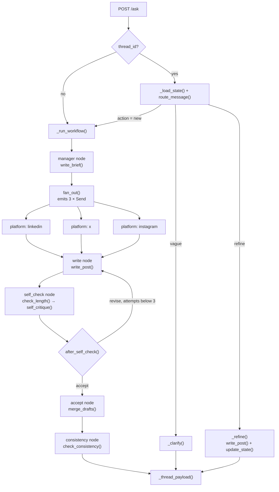

# Mohit Madireddy — Profile & Project Portfolio

> Software Developer · Hyderabad, India · Java/Spring Boot backend → GenAI / Agentic AI engineering
> 📧 madireddymohit@gmail.com

---

## Table of Contents

1. [About Me](#1-about-me)
2. [Experience](#2-experience)
3. [Skills](#3-skills)
4. [Featured Project — Autonomous Social Media Content Studio](#4-featured-project--autonomous-social-media-content-studio)
   - 4.1 [Problem & Goal](#41-problem--goal)
   - 4.2 [What the System Does](#42-what-the-system-does)
   - 4.3 [Architecture](#43-architecture)
   - 4.4 [The Five Agents](#44-the-five-agents)
   - 4.5 [The Six Graph Nodes](#45-the-six-graph-nodes)
   - 4.6 [The Self-Critique Loop](#46-the-self-critique-loop)
   - 4.7 [Follow-ups: the Intent Router](#47-follow-ups-the-intent-router)
   - 4.8 [State Design & Concurrency](#48-state-design--concurrency)
   - 4.9 [Cost, Latency & Quality Optimisation](#49-cost-latency--quality-optimisation)
   - 4.10 [Persistence & Memory](#410-persistence--memory)
   - 4.11 [Observability](#411-observability)
   - 4.12 [REST API](#412-rest-api)
   - 4.13 [Frontend](#413-frontend)
   - 4.14 [Testing](#414-testing)
   - 4.15 [Design Patterns Used](#415-design-patterns-used)
   - 4.16 [Tech Stack](#416-tech-stack)
   - 4.17 [Project Structure](#417-project-structure)
   - 4.18 [Running the Project](#418-running-the-project)
   - 4.19 [Design Trade-offs & Honest Caveats](#419-design-trade-offs--honest-caveats)
5. [Other Projects](#5-other-projects)
6. [Learning & Upskilling](#6-learning--upskilling)
7. [Beyond Work](#7-beyond-work)

---

## 1. About Me

I am a software developer based in Hyderabad with about 1.7 years of professional experience. I started my career as a Java/Spring Boot backend engineer, building banking and agriscience client applications with React front-ends, and over the last year I have deliberately moved my focus to Generative AI and Agentic AI engineering — RAG systems, multi-agent orchestration with LangGraph, LlamaIndex pipelines, and the production concerns around them (observability, evaluation, cost routing, testing).

What I care about in engineering is the part after the demo works: bounded loops instead of "retry until it looks right", typed outputs instead of string parsing, deterministic checks before paid model calls, and test suites that prove behaviour without needing an API key. The featured project below is the clearest example of how I like to build.

| | |
|---|---|
| **Current role** | Software Developer, ADQ Services Pvt Ltd (Hyderabad) — full-time since Feb 2026 |
| **Focus** | Agentic AI applications, RAG, LangGraph/LangChain, LlamaIndex, FastAPI backends, data/ETL pipelines |
| **Background** | Java · Spring Boot · ReactJS · SQL (≈1.3 years) before transitioning to GenAI |
| **Learning track** | NIIT Agentic AI program (Courses 2 → 5, each with a course-end project) |

---

## 2. Experience

### Software Developer — ADQ Services Pvt Ltd, Hyderabad
*Feb 2026 – Present*

ADQ Services is a Hyderabad-based IT company with an Agentic AI offering. My work spans GenAI application engineering (Python, LangChain/LangGraph, LlamaIndex, FastAPI) and data engineering tasks such as building ETL pipelines from raw sources to analytics-ready schemas.

### Associate Software Engineer — Empover I-Tech Pvt Ltd
*Oct 2024 – Dec 2025 (≈1.3 years)*

Full-stack delivery on Banking and Agriscience client projects — **Vyapara Mithra**, **Syngenta Admin Portal**, **ZCZC**, and **ShaktiSeeds Admin Portal** — using Java/Spring Boot on the backend and ReactJS (Hooks, Redux, Tailwind) on the frontend.

- Applied design patterns (Facade, Singleton, Builder) to keep service layers readable and testable.
- Implemented centralized error handling across REST APIs.
- Diagnosed and fixed N+1 query problems in JPA/Hibernate data access.
- Built responsive client dashboards and admin portals.

### Web Developer Intern — Defence Research & Development Organisation (DRDO)

Early hands-on web development experience in a government research environment.

---

## 3. Skills

| Area | Technologies |
|---|---|
| **Languages** | Python, Java, JavaScript (ES2022+), SQL |
| **GenAI / Agentic AI** | LangGraph (StateGraph, Send fan-out, subgraphs, checkpointers), LangChain / LCEL, LlamaIndex, RAG (hybrid BM25 + vector, reranking, agentic RAG), structured outputs with Pydantic, prompt engineering & prompt caching, MCP (Model Context Protocol) servers and clients, ReAct / Reflection / Plan-Act-Check patterns |
| **LLM providers & serving** | Azure OpenAI (gpt-4o-mini / gpt-4o), OpenAI, Groq, Google Gemini, local Ollama, LiteLLM gateway/routing |
| **Evaluation & safety** | RAGAS (faithfulness, answer relevance, context precision/recall), Guardrails AI validators, human-in-the-loop escalation design |
| **Observability** | Langfuse (v3 SDK, LangChain callback handler, LlamaIndex instrumentation), structured logging, trace/event models |
| **Backend** | FastAPI, Uvicorn, Spring Boot, Spring Security (JWT), Spring Data JPA/Hibernate, REST API design, webhooks (Razorpay) |
| **Frontend** | React 19, Redux / react-redux / redux-persist, React Router, Tailwind CSS v4, PrimeReact, Vite, Streamlit |
| **Data** | PostgreSQL + pgvector, MySQL, SQLite (WAL), pandas / NumPy, Jupyter, star-schema modelling, Power BI |
| **Testing** | pytest (markers, fixtures, coverage), scriptable fake-LLM fixtures, FastAPI TestClient, JUnit |
| **Tooling** | uv, pip, npm, Ruff, ESLint, Git/GitHub, Docker basics, macOS |
| **Design patterns** | Orchestrator–Worker, Scatter–Gather, Reflection, State Machine, Memento/Checkpoint, Repository, Facade, Strategy, Observer, State, Builder, Singleton |

---

## 4. Featured Project — Autonomous Social Media Content Studio

**A stateful multi-agent publishing system that turns one piece of source material into publish-ready LinkedIn, X and Instagram posts — written in parallel, self-critiqued, reconciled for consistency, and fully traceable.**

| | |
|---|---|
| **Type** | NIIT Agentic AI — Course 4 course-end project (full-stack, individually built) |
| **Backend** | Python 3.12 · FastAPI 0.121 · LangGraph 1.0 · LangChain 1.0 · SQLite (WAL) · Langfuse 3.9 |
| **Frontend** | React 19 · Vite 8 · Redux 5 · React Router 7 · Tailwind CSS v4 · PrimeReact 11 |
| **Models** | Azure OpenAI `gpt-4o-mini` (strong tier) + local Ollama (cheap tier), routed per task |
| **Agents / Nodes** | 5 LLM agents · 6 LangGraph nodes · 1 bounded self-correction loop |
| **Tests** | 268 automated tests (208 unit / 60 integration) · 99.4% statement + branch coverage · ~6 s · no network, no API key |

### 4.1 Problem & Goal

Content teams publish the same idea across several platforms, and every platform wants a different tone, length and structure. Doing that adaptation by hand is repetitive; doing it with a single LLM prompt produces three isolated posts that nobody reviewed and that may quietly contradict each other (a "40 % fewer incidents" on LinkedIn that becomes "1.7× better" on X).

The brief for this project asked for an autonomous system that behaves like a small content agency: a **Content Manager** delegating to **platform-specific agents**, **critique and refinement loops** before anything ships, **manager-led synthesis** into a consistent package, and explicit **optimisation for cost, latency and quality** — all modelled as a LangGraph state machine.

### 4.2 What the System Does

1. The user pastes an article, transcript or rough idea (or picks a sample) in the React UI.
2. A **Manager** agent condenses it into one self-contained brief (< 150 words): core message, audience, key points, angle.
3. Three **Platform Writers** (LinkedIn, X, Instagram) draft from that brief **in parallel**. They never see the raw source or each other's drafts — the brief is the only shared context.
4. Each draft passes a free, deterministic **length gate**, then a **Self-Critic** pass. If the critic returns a problem, the writer revises (up to **3 attempts**).
5. Once all three branches accept, a **Consistency Checker** compares the finished posts for contradictions and triggers targeted rewrites.
6. The response returns the brief, three posts, a human-readable action log, and structured trace events. Everything is checkpointed to SQLite under a `thread_id`.
7. Follow-up messages on the same thread ("make the X post punchier", "do the same for LinkedIn") are classified by an **Intent Router** and applied as targeted refinements — without re-running the whole pipeline.

### 4.3 Architecture

The graph is built in **two layers**. The outer graph owns the run; the middle node is itself a compiled **subgraph** containing the per-platform write → check → revise cycle. Nesting is what lets three platforms retry independently without duplicating node definitions.

```
outer graph      START → manager → [fan_out: 3 × Send] → platform → consistency → END
platform subgraph START → write → self_check → { "revise" → write | "accept" → accept → END }
```



**Request lifecycle for a new run**

| # | Stage | Component | Model calls |
|---|---|---|---|
| 1 | Validate the body | `SocialInput` (Pydantic, `src/models/models.py`) | 0 |
| 2 | Write the brief | `manager` node → `write_brief()` | 1 |
| 3 | Fan out to three platforms | `fan_out()` → three `Send` objects | 0 |
| 4 | Draft a post | `write` node → `write_post()` | 1 per attempt |
| 5 | Length gate, then critique | `self_check` node → `check_length()` / `self_critique()` | 0 or 1 |
| 6 | Loop or publish | `after_self_check()` | 0 |
| 7 | Publish into shared state | `accept` node | 0 |
| 8 | Reconcile the three posts | `consistency` node → `check_consistency()` | 1 (+ rewrites) |
| 9 | Persist and respond | `ThreadStore` + `_thread_payload()` | 0 |

A clean run costs **8 model calls** (1 brief + 3 drafts + 3 critiques + 1 consistency). The hard attempt ceiling caps the absolute worst case at **20**.

### 4.4 The Five Agents

Every agent is *a prompt plus one model call*, all defined in `src/agent.py`. Every call in the application goes through exactly two functions — `ask()` for plain text and `ask_structured()` for schema-constrained output — which is what makes the whole system testable by patching two names.

| Agent | Function | Goal | Notes |
|---|---|---|---|
| **Manager** | `write_brief()` | Turn arbitrary-length source into one self-contained brief every other agent works from | Runs once per run. Tier routed on the source text. If the brief is wrong, every post is wrong — so it is logged in full. |
| **Platform Writer ×3** | `write_post()` | Produce a publish-ready post inside one platform's character limit and house style | One function, three concurrent instances; platform is a parameter, rules come from a single `RULES` table (LinkedIn 3000 · X 280 · Instagram 2200 chars). On a revision pass it receives `old_draft` + `fix`, so generation becomes *editing*. |
| **Self-Critic** | `self_critique()` | Decide **OK** or hand back *one* concrete, imperative fix | Runs only after the free length gate passes. Sees its own previous note on attempt ≥ 2. Told to accept on the final attempt unless the draft is factually wrong or off-brief. **Pinned to the strong tier** — its output becomes the writer's next instruction. |
| **Consistency Checker** | `check_consistency()` | Catch contradictions (numbers, dates, claims) across the three finished posts | Structured output (`ConsistencyReport` → `list[Conflict]`). Explicitly told to ignore style — different tone per platform is intended. The only agent that ever sees all three drafts. |
| **Intent Router** | `route_message()` | On a follow-up message, decide what the user actually means before anything runs | Structured output `RefineIntent {action: "refine"\|"new", platforms: list[Literal["linkedin","x","instagram"]], instruction}`. Sees the last 5 edits as history. Lives in `main.py`, above the graph — it decides whether to invoke the graph at all. |

One deterministic control is deliberately **not** an agent: `check_length()` compares a draft to its platform limit in plain Python. It is free, exact and instantaneous, and it runs *before* the critic so an over-long draft never spends a model call.

### 4.5 The Six Graph Nodes

Nodes and agents are not one-to-one — six nodes host five agents, and the two exceptions are where the design lives.

| Node | Agent it runs | Model call? | Role in the graph |
|---|---|---|---|
| `manager` | Manager — `write_brief()` | Yes · 1 per run | First node after `START`; its conditional edge `fan_out()` launches three parallel branches |
| `platform` | *(subgraph wrapper)* | No | Container LangGraph `Send()`s into; three instances run in the same superstep, each in its own checkpoint namespace |
| `write` | Platform Writer — `write_post()` | Yes · 3–9 per run | Entry of the subgraph; picks fresh-draft vs revision from `state["problem"]`; increments `attempts` |
| `self_check` | Self-Critic, after `check_length()` | Only if length passes | Feeds `after_self_check()` — the actual branch decision |
| `accept` | *none — pure state transition* | No | Tags the draft `accepted` or `accepted_as_is`; three outputs merge via `merge_drafts()` |
| `consistency` | Consistency Checker — `check_consistency()` | Yes · 1 per run (+ rewrites) | Last node; runs once after all branches join |

`accept` has a node but no agent — publishing an approved draft into shared state is an explicit, checkpointable step rather than a side effect hidden inside the critic. The Router has an agent but no node — a component that chooses whether to run the graph cannot live inside it.

### 4.6 The Self-Critique Loop

Each platform branch implements the **Reflection (Self-Refine)** pattern: the same model writes the draft and judges it under two different prompts, bounded by a fixed attempt budget so it always terminates.

```
write_node ──► check_length ──► self_critique ──► after_self_check ──► accept_node
    ▲          (deterministic)   (strong tier)      problem && attempts < 3 ?
    └──────────────────── "revise" ◄───────────────────────┘
```

**Verdict hardening.** A critic verdict is free text, but the loop treats it as a control signal, so two guards sit between the raw output and the router — and all of them fail *towards acceptance*, because an unusable verdict is not evidence the draft is bad (it already passed the length gate):

| Guard | Catches | Result |
|---|---|---|
| Empty verdict | Model returned nothing | Accept, logged at WARNING |
| `_is_ok()` | Decorated approvals — `OK.`, `**OK**`, reasoning that ends with `OK` | Accept |
| `_is_malformed()` | Verdict > 400 chars, or containing the critic's own checklist markers (`## check`, `1. message` …) | Accept, logged at WARNING — this text must never reach the writer |

**Four independent termination guarantees:** a hard `MAX_ATTEMPTS = 3` ceiling; the critic is shown its own previous note (so a stateless review cannot re-raise the same complaint forever); a lowered bar on the final pass; and the malformed-verdict guard. When the budget runs out with a problem still open, the draft ships flagged `accepted_as_is` — never silently presented as clean.

The loop is even observable in the database: because each branch is its own checkpoint namespace, **5 / 7 / 9 checkpoints** in a platform namespace mean clean-first-pass / one revision / two revisions.

### 4.7 Follow-ups: the Intent Router

A second request on the same `thread_id` does **not** re-run the graph. The saved state is loaded from the checkpoint, and `route_message()` classifies the message into one of three outcomes:

| Router said | Handler | What happens |
|---|---|---|
| `action == "new"` | `_run_workflow()` | Fresh source material → starts a new thread |
| No platforms **or** no instruction | `_clarify()` | Asks the user which post / what change instead of guessing an edit (UI shows options `[linkedin, x, instagram, all]`) |
| Otherwise | `_refine()` | Calls `write_post()` once per targeted platform with `fix=instruction`, then `workflow_graph.update_state()` writes the result back into the checkpoint — so a refinement survives a reload |

Because `platforms` is a `Literal` of the three supported platforms, a request naming Facebook or TikTok cannot be mapped onto the nearest platform: the type system rejects it before any code runs. Rewriting the *wrong* post is the worst available outcome, and the schema makes it unrepresentable.

### 4.8 State Design & Concurrency

Workflow state is declared as three `TypedDict`s in `src/schemas/state.py`:

| Schema | Scope | Purpose |
|---|---|---|
| `State` | Outer graph | `topic`, `brief`, `drafts`, `action_log`, `trace_events` |
| `PlatformState` | One branch | Adds `platform`, `draft`, `problem`, `attempts` |
| `PlatformOutput` | Branch output | Restricts what a branch may publish upward — without it, branch-local working values would leak into the parent and three branches would collide |

Three branches write to the same keys in the same superstep, so every shared channel declares a **reducer**:

```python
class State(TypedDict):
    topic: str
    brief: str
    drafts: Annotated[Dict, merge_drafts]            # per-platform merge
    action_log: Annotated[List[str], operator.add]   # concatenates across branches
    trace_events: Annotated[List[Dict], operator.add]
```

There is no coordination code anywhere in the app — no locks, no queues, no join logic. Concurrency safety is a property of the schema, and each reducer is unit-tested directly. The fan-out reads the platform list from `RULES`, so adding a fourth platform is a change to one dictionary, not to the graph.

### 4.9 Cost, Latency & Quality Optimisation

**Cost**

| Measure | Mechanism |
|---|---|
| Two-tier model routing | `configs/llms.py` → `model_for(task, text)`. Routine copy runs on a local Ollama model at zero marginal cost; harder material reaches paid Azure inference. A LiteLLM gateway config (`litellm_config.yaml`) with fallback `simple-agent → complex-agent` is included as an alternative. |
| Zero-cost routing decision | Tier is chosen by whole-word keyword match (`COMPLEX_KEYWORDS` / `SIMPLE_KEYWORDS`) plus a 120-word length threshold — no model is consulted to pick a model |
| Capability pinning | `router`, `consistency`, `critique` are pinned to the strong tier (`PINNED_TASKS`) — a cheap model without reliable tool-calling doesn't degrade gracefully, it breaks the loop |
| Free gate before the paid one | `check_length()` runs before the critic |
| Refinement without re-running | Follow-ups patch checkpoint state via `update_state()` — one call per targeted post instead of a fresh 8-call run |
| Bounded worst case | `MAX_ATTEMPTS` caps a run at 20 model calls vs 8 for a clean run |

**Latency** — true parallelism (three platforms in one LangGraph superstep, so wall-clock = slowest platform, not the sum); `get_model()` memoised with `lru_cache` per tier/temperature so HTTP clients are built once per process; the Ollama health probe memoised with a 2-second timeout; prompt-prefix caching; and the deterministic length check removing a network round-trip from every over-long draft.

**Prompt caching** — Azure/OpenAI cache a prompt prefix automatically only above a **1 024-token floor** and only when byte-identical across calls. The original per-agent system prompts (156–615 tokens) met neither condition: the run log showed forty misses and zero hits. The fix hoisted all shared studio policy — platform rulebook, house voice, banned phrases, fact discipline — into one static `SHARED_PREFIX` (~1 550 tokens) placed first on every call. Every call type now clears the floor; an import-time guard raises if the prefix is ever edited below it; and a `CacheUsageHandler` callback reads `prompt_tokens_details.cached_tokens` off every response and logs `HIT`/`MISS` with the cached share — because caching that cannot be observed should not be claimed.

**Quality** — five independent gates: the shared policy prefix (rules can't drift between agents), deterministic limits, self-critique, typed outputs (`Literal` platforms), and cross-platform reconciliation. The free deterministic gate runs before the paid one, so quality and cost pull in the same direction.

**Graceful degradation** — every structured call declares a typed fallback, and every optional step is wrapped so its failure can't take down a request that already succeeded:

| If this fails… | …the system does this |
|---|---|
| The critic | Accepts the draft (it already passed the length gate) |
| The consistency check | Ships the posts unreconciled — three approved posts beat a 500 |
| A reconciliation rewrite | Keeps the original draft for that platform, continues with the others |
| The router | Returns an empty intent → API asks the user rather than guessing |
| Ollama (local tier) | Falls back to Azure automatically; probed once per process |
| Model failure in a run | Surfaces as a clean HTTP 500, not a stack trace |

### 4.10 Persistence & Memory

Memory is handled in three layers, all backed by a single SQLite file at `backend/data/studio.db`.

| Layer | Lifetime | Implementation |
|---|---|---|
| Working memory | One run | LangGraph channel state; reducers accumulate log and trace across parallel branches |
| Durable graph memory | Per thread, indefinite | `SqliteSaver` writes a checkpoint every superstep to the `checkpoints` and `writes` tables — a thread survives a process restart and can be reloaded, resumed or audited |
| Conversation memory | Per thread, indefinite | The app-owned `threads` table (`id, title, created_at, updated_at, messages JSON`) — a purpose-built index for the sidebar, managed by `ThreadStore` (Repository pattern; no other module writes SQL) |

All three tables join on the same `thread_id` UUID. `DELETE /threads/{id}` removes the index row **and** the checkpoints in the same request so nothing is orphaned. Two connections share one file safely through `PRAGMA journal_mode=WAL` (readers don't block the writer), `PRAGMA busy_timeout=5000`, and a `threading.Lock` around writes (including the read-modify-write in `append_messages()`). Thread isolation is asserted by an integration test.

### 4.11 Observability

There is no human reviewer, so the run trace *is* the product's audit trail.

- Every node emits a **structured trace event** (`src/utils/trace.py`): step, actor, status, detail, attempt, duration and a sort stage. The frontend's `TracePanel` renders these grouped by actor (Manager → platforms → Consistency) or as a timeline, with per-run attempt count and total duration.
- A parallel human-readable **action log** accumulates on the same reducer, so a run can be read as prose.
- **Langfuse** tracing (`src/callbacks/langfuse_callback.py`): a `LangfuseCallbackManager` builds a per-request run config with `langfuse_session_id = thread_id`, tags (`new` / `refine` / `router`) and run names; traces are flushed after every `/ask`. Fully optional — if keys are absent the app logs a warning and runs untraced.
- **Structured logging** everywhere (`configs/logger.py`): every LLM call logs task, tier, target model, routing reason, char counts and elapsed ms; cache HIT/MISS lines; route decisions; and a `preview()` helper that truncates long text safely.

### 4.12 REST API

| Route | Handler | Purpose |
|---|---|---|
| `POST /ask` | `social_query()` | New run (no `thread_id`) or follow-up (with `thread_id`) → returns `{thread_id, brief, posts, trace, events, messages, action, …}` |
| `GET /threads` | `list_threads()` | Sidebar list ordered by `updated_at` |
| `GET /threads/{id}` | `get_thread()` | Reload a thread from its checkpoint |
| `DELETE /threads/{id}` | `delete_thread()` | Remove index row + checkpoints |
| `GET /platforms` | `platforms()` | Platform ids and character limits (drives the UI counters) |
| `GET /health` | `health()` | Status + database path |

Request body is `SocialInput { query: str, thread_id: str | None }`. CORS is enabled for the Vite dev origin.

### 4.13 Frontend

A single-page React 19 app (Vite 8, React Compiler enabled) styled with Tailwind CSS v4 and PrimeReact/PrimeIcons.

| Concern | Implementation |
|---|---|
| Routing | `react-router-dom` 7 — `/` (Login, `PublicRoute`), `/studio` and `/dashboard` (`ProtectedRoute`) |
| State | Redux 5 + `react-redux` 9 + `redux-persist`; reducers `authReducer`, `threadsReducer` (normalised `byId` / `order` / `activeId` / `status` / `clarify`), `loaderReducer` |
| Data hook | `useStudio()` — loads platform limits and the thread list, and exposes `generate`, `followUp`, `selectThread`, `removeThread`, `newSource`, `dismissClarify` plus `isGenerating` / `isRefining` / `isLoadingThread` flags |
| API layer | `utils/studio_api.js` + `network_utils.js` (`askStudio`, `fetchThreads`, `fetchThread`, `deleteThread`, `fetchPlatforms`) |
| Pages | `Login` · `Studio` (shell) · `SourceInput` ("One idea. Three platforms." — paste box, three sample sources, recent threads) · `Results` (brief card, three `PostCard`s with char counters and one-click "Refine", chat transcript, follow-up `ChatBar` with clarify options, `TracePanel`) · `Dashboard` |
| Components | `TopBar`, `ThreadDropdown`, `ChatBox`, `ChatBar`, `BriefCard`, `PostCard`, `TracePanel`, `Skeletons`, `BrandDot` |
| UX details | Skeleton loaders while "Writing the brief, then all three posts in parallel…"; expired-thread detection (`THREAD_EXPIRED`) when the server no longer has a checkpoint; optimistic thread removal with rollback on failure |

### 4.14 Testing

**268 tests — 208 unit, 60 integration — 99.4 % statement and branch coverage, ~6 seconds, no network, no API key, no Ollama, no real LLM call.**

The whole mock is one fixture: every model call funnels through `src.agent.ask` and `src.agent.ask_structured`, so the `studio` fixture patches those two names and nothing else. The fixture is scriptable, so a test states a scenario and asserts the consequence:

```python
def test_a_rejected_draft_is_revised_and_re_checked(studio, graph):
    studio.set_verdicts("x", ["Replace the opening line.", "OK"])
    ...
```

Markers (`unit` / `integration`) are applied automatically by directory in `tests/conftest.py`. What the integration tests prove: three posts are written in parallel from a single brief; a rejected draft is revised and re-checked, and **only** that platform is rewritten; the loop stops at `MAX_ATTEMPTS` and ships `accepted_as_is`; an over-length draft is caught without spending a critic call; graph state is checkpointed, reloadable and isolated per `thread_id`; a vague follow-up returns `action: "clarify"` and leaves posts untouched; `DELETE` clears both the index and the checkpoints; a model failure becomes a 500.

```
uv sync --extra dev
uv run pytest                          # everything
uv run pytest -m unit                  # or -m integration
uv run pytest --cov --cov-report=html  # open htmlcov/index.html
```

### 4.15 Design Patterns Used

| Pattern | Where |
|---|---|
| Orchestrator–Worker | One manager produces a brief; three workers execute against it independently |
| Scatter–Gather (map-reduce) | `fan_out()` scatters three `Send`s; `merge_drafts()` gathers the results |
| Reflection (Generator–Critic) | The writer evaluates its own output before publication |
| State Machine | Nodes and conditional edges are declared, inspectable and diagrammable (`draw_mermaid()` at boot) |
| Memento / Checkpoint | `SqliteSaver` snapshots full state every superstep — reload, resume, time-travel |
| Repository | `ThreadStore` encapsulates every SQL statement |
| Facade | `ask()` / `ask_structured()` are the only entry points to any model |
| Strategy | `resolve_tier()` chooses, `get_model()` constructs — callers know neither |
| Observer | `CacheUsageHandler` subscribes to completion events and reports cache behaviour without altering results |

### 4.16 Tech Stack

| Layer | Technology | Version |
|---|---|---|
| Language / runtime | Python | 3.12 (managed with `uv`) |
| API | FastAPI · Uvicorn | 0.121 · 0.38 |
| Orchestration | LangGraph · `langgraph-checkpoint-sqlite` | 1.0.0 · ≥ 2.0 |
| LLM SDKs | `langchain-core` · `langchain-openai` · `langchain` | 1.0.1 · 1.0.0 · ≥ 1.0.2 |
| Models | Azure OpenAI `gpt-4o-mini` · Ollama (`llama3.2` default) · optional LiteLLM proxy | — |
| Observability | Langfuse | 3.9.1 |
| Validation | Pydantic (`BaseModel`, `field_validator`, `Literal`) | v2 |
| Persistence | SQLite (WAL) | stdlib |
| Lint / test | Ruff · pytest · pytest-cov · httpx | — |
| Frontend | React · Vite · Redux · react-router-dom · Tailwind CSS · PrimeReact · ESLint | 19 · 8 · 5 · 7 · 4 · 11 · 10 |

### 4.17 Project Structure

```
c4-autonomous-social-media-content-studio/
├── README.md                          # Project brief: problem, requirements, deliverables, evaluation
├── self-critique-loop.pdf             # Architecture reference: every box/arrow of the reflection loop → code
│
├── backend/
│   ├── main.py                        # FastAPI app: /ask, /threads, /platforms, /health; run/refine/clarify handlers
│   ├── pyproject.toml                 # Dependencies, optional extras (gateway, dev), pytest + coverage config
│   ├── uv.lock
│   ├── litellm_config.yaml            # Optional LiteLLM gateway: simple-agent (Ollama) → complex-agent (Azure) fallback
│   ├── .env                           # AZURE_OPENAI_*, OLLAMA_*, LANGFUSE_*, STUDIO_DB_PATH (not committed)
│   ├── CODE_FLOW.md                   # Which function runs at each stage, with line references
│   ├── TESTING.md                     # Test commands, markers, coverage, fake-LLM fixture explained
│   ├── Backend_Technical_Documentation.docx
│   ├── Backend_Review_refactor.pptx   # 12-slide architecture briefing
│   ├── Agents_and_Nodes_Reference.pdf # 5 agents × 6 nodes — goals, responsibilities, roles
│   │
│   ├── configs/
│   │   ├── llms.py                    # Two-tier model routing, PINNED_TASKS, lru_cache clients, Ollama probe,
│   │   │                              #   CacheUsageHandler (prompt-cache HIT/MISS logging)
│   │   ├── database.py                # SQLite connect() with WAL/busy_timeout, threads schema, write_lock
│   │   └── logger.py                  # get_logger(), preview()
│   │
│   ├── src/
│   │   ├── agent.py                   # THE ONLY FILE THAT TALKS TO A MODEL: ask(), ask_structured(), RULES,
│   │   │                              #   write_brief, write_post, check_length, self_critique, route_message,
│   │   │                              #   check_consistency, RefineIntent, ConsistencyReport
│   │   ├── graphs/graph.py            # build_checkpointer(), build_platform_graph(), build_graph()
│   │   ├── node/
│   │   │   ├── manager_node.py        # manager → write_brief()
│   │   │   ├── writer_node.py         # write → write_post() (fresh vs revise), attempt counter
│   │   │   ├── self_check_node.py     # self_check → check_length() then self_critique()
│   │   │   ├── accept_node.py         # accept → accepted / accepted_as_is
│   │   │   └── consistency_node.py    # consistency → check_consistency() + targeted rewrites
│   │   ├── routes/routing.py          # MAX_ATTEMPTS = 3, after_self_check(), fan_out() (Send ×3)
│   │   ├── schemas/state.py           # State, PlatformState, PlatformOutput, merge_drafts reducer
│   │   ├── models/models.py           # SocialInput request model
│   │   ├── store/thread_store.py      # ThreadStore repository (threads table)
│   │   ├── callbacks/langfuse_callback.py  # LangfuseCallbackManager, build_run_config(), flush
│   │   ├── utils/
│   │   │   ├── prompts.py             # SHARED_PREFIX (~1.5k tokens) + per-agent SYSTEM/TASK templates
│   │   │   ├── trace.py               # event() → structured trace events, STAGE_ORDER
│   │   │   ├── url_input.py           # fetch_url() scaffolding (not yet wired to an endpoint)
│   │   │   └── write_post.py          # deprecated shim → src.agent.write_post
│   │   ├── crews/ · tools/            # reserved (.gitkeep)
│   │
│   ├── data/studio.db                 # threads + LangGraph checkpoints/writes (WAL)
│   ├── logs/run.log
│   ├── htmlcov/                       # coverage HTML report
│   └── tests/
│       ├── conftest.py                # shared fixtures, auto-marking, the scriptable fake LLM
│       ├── unit/
│       │   ├── test_agent_calls.py        # ask / ask_structured / write_post / self_critique / route_message
│       │   ├── test_agent_helpers.py      # check_length, _is_ok, _is_malformed, _messages
│       │   ├── test_llms_cache.py         # _read_cache_usage and HIT/MISS logging
│       │   ├── test_llms_models.py        # get_model, _build_azure, Ollama probe, model_for
│       │   ├── test_llms_routing.py       # complexity heuristic and tier pinning
│       │   ├── test_prompts.py            # SHARED_PREFIX, cache-floor guard, template rendering
│       │   ├── test_state_and_routing.py  # merge_drafts, reducers, after_self_check, fan_out
│       │   ├── test_thread_store.py       # every ThreadStore method against in-memory SQLite
│       │   └── test_trace_and_models.py   # trace events, SocialInput, RefineIntent, preview
│       └── integration/
│           ├── test_api.py                # every FastAPI endpoint through TestClient
│           ├── test_graph_flow.py         # the compiled LangGraph end to end
│           └── test_nodes.py              # each node with its real neighbours
│
└── frontend/
    ├── package.json                   # React 19, Vite 8, Redux 5, Router 7, Tailwind 4, PrimeReact 11
    ├── vite.config.js · eslint.config.js · index.html
    ├── public/                        # favicon.svg, icons.svg
    └── src/
        ├── main.jsx · App.jsx         # Router: / (Login) · /studio · /dashboard
        ├── index.css · tailwind.config.js
        ├── pages/
        │   ├── Login.jsx              # Sign-in → AUTH_LOGIN, redirect back
        │   ├── Studio.jsx             # Shell: TopBar + SourceInput | Results, wired to useStudio()
        │   ├── SourceInput.jsx        # "One idea. Three platforms." — input, sample sources, recent threads
        │   ├── Results.jsx            # BriefCard, 3× PostCard, transcript, ChatBar, TracePanel
        │   └── Dashboard.jsx
        ├── components/
        │   ├── TopBar.jsx · ThreadDropdown.jsx · ChatBox.jsx · ChatBar.jsx
        │   ├── BriefCard.jsx · PostCard.jsx · TracePanel.jsx · Skeletons.jsx · BrandDot.jsx
        ├── hooks/useStudio.js         # All studio data flow: generate, followUp, selectThread, removeThread…
        ├── store/
        │   ├── index.js               # Redux store + redux-persist
        │   ├── authReducer.js · threadsReducer.js · loaderReducer.js
        ├── routes/ProtectedRoute.jsx · PublicRoute.jsx
        ├── utils/
        │   ├── studio_api.js · network_utils.js · url_constants.js
        │   ├── platforms.js           # per-platform labels, icons, chips
        │   └── traceEvents.js         # step styles, ordering, grouping and summarising trace events
        └── assets/
```

### 4.18 Running the Project

**Backend**

```bash
cd backend
uv sync                              # or: uv sync --extra dev  (tests) / --extra gateway (LiteLLM)
# create backend/.env with:  AZURE_OPENAI_ENDPOINT, AZURE_OPENAI_API_KEY, AZURE_OPENAI_API_VERSION,
#                            AZURE_OPENAI_DEPLOYMENT
# optional:                  AZURE_OPENAI_DEPLOYMENT_SIMPLE, OLLAMA_BASE_URL, OLLAMA_MODEL,
#                            LANGFUSE_PUBLIC_KEY, LANGFUSE_SECRET_KEY, LANGFUSE_HOST, STUDIO_DB_PATH
ollama serve && ollama pull llama3.2 # optional cheap tier; falls back to Azure if not running
uv run python main.py                # http://localhost:8000  (prints the compiled graph as Mermaid on boot)
```

**Frontend**

```bash
cd frontend
npm install
npm run dev                          # http://localhost:5173  (VITE_BACKEND_URL in frontend/.env, defaults to :8000)
```

**Try it**

```bash
curl -X POST http://localhost:8000/ask -H 'content-type: application/json' \
  -d '{"query": "A study of 1,200 engineering teams found that teams shipping daily had 40% fewer production incidents than teams shipping monthly."}'
# → thread_id, brief, posts{linkedin,x,instagram}, trace[], events[]

curl -X POST http://localhost:8000/ask -H 'content-type: application/json' \
  -d '{"thread_id": "<id>", "query": "Make the X post more opinionated"}'
# → action: "refine", refined: ["x"]   (only the X post is rewritten)
```

### 4.19 Design Trade-offs & Honest Caveats

- **LangGraph over CrewAI.** I considered a CrewAI-manager / LangGraph-node hybrid and chose pure LangGraph so that the manager → workers hierarchy is an explicit, checkpointable, machine-diagrammed state graph rather than an opaque crew. The cost is more boilerplate per node; the benefit is that every transition is testable in isolation.
- **Prompt caching is a latency and consistency win, not a cost win.** At these prompt sizes the shared prefix adds roughly as many tokens as it saves, and cached tokens bill at half rate. Claiming it as an invoice reduction would be inaccurate.
- **No response-level cache — on purpose.** Exact-match caching would return byte-identical posts for identical source, removing exactly the variation a content generator exists to provide. It remains an option for the deterministic agents (router, critic, consistency).
- **Full-state checkpoints, not diffs.** Storage traded for the ability to resume or inspect any step; the live DB was ~1.2 MB for 95 checkpoints.
- **Keyword-based tier routing is a heuristic.** It costs nothing and is easy to reason about, but it can misjudge unusual sources; the capability-pinned tasks are what keep a misroute from breaking the loop.
- **Login is UI-only.** The sign-in screen sets client state for the demo; there is no server-side auth layer yet.
- **Scaffolding not yet wired:** `url_input.py` (`fetch_url()` for URL sources) and the `crews/` / `tools/` packages are reserved for the next iteration.

---

## 5. Other Projects

### MedLearn Assist (a.k.a. DocMind) — Agentic RAG for medical education
*NIIT Course 3 course-end project · LlamaIndex · FastAPI · PostgreSQL + pgvector · React*

A full-stack agentic RAG application. Retrieval is hybrid **BM25 + vector** via `QueryFusionRetriever` with Reciprocal Rank Fusion, with the top-15 candidates re-ranked by a local FlashRank cross-encoder (no extra LLM call). Multimodal ingestion uses **LlamaParse** routing for tables and diagrams, per-modality extraction (semantic text chunks via `SemanticSplitterNodeParser`, LLM table summaries, vision-model image captions) and structural + medical metadata on every node for `VectorIndexAutoRetriever` filtering. A **ReAct agent** routes across three tool families — a vector documents tool, a read-only clinical SQL tool over six fixed tables, and **PubMed/NCBI MCP** literature tools (`BasicMCPClient` + `McpToolSpec`) — under an enforced retrieve-before-answer grounding rule. Safety and evaluation: Guardrails PII redaction, SQL write-intent blocking, per-answer **RAGAS** faithfulness + answer-relevance scoring, **Langfuse** tracing, and automatic human hand-off via email escalation on quality drops. The React frontend streams over **Server-Sent Events** with live pipeline rendering, token streaming and inline retrieved tables/images. Also bridged to Claude Desktop via a FastMCP stdio server. A Gemini migration (from Azure OpenAI) is underway.

### Retail Policy Intelligence & Decision Support System — Capstone (in progress)
*NIIT Course 5 capstone · Python 3.12 · FastAPI + LangGraph · LlamaIndex + LlamaParse · PostgreSQL + pgvector · Azure OpenAI*

An **SLO-bound** multi-agent system that routes policy/compliance questions to RAG, SQL (NL2SQL) or hybrid paths, classifies risk, scores confidence and **escalates high-risk cases to human review**. Reuses and extends the patterns from the two earlier projects: hybrid BM25 + semantic fusion retrieval with reranking, MCP tools (including a third-party DuckDuckGo MCP server over streamable HTTP), a heuristic model router with a **LiteLLM gateway** (gpt-4o-mini small tier / gpt-4o strong tier), caching, and logging everywhere. Deliverables include architecture diagrams, an SLO report, observability evidence, an escalation workflow, a runbook and an enterprise-style streaming chat frontend.

### AI Real Estate Assistant Bot
*NIIT Course 2 course-end project · LangChain · LCEL*

A conversational assistant using **LangChain routing** and **LCEL chains** (`RunnableBranch`), enriched with Nominatim geocoding, OpenTripMap amenity look-ups and Tavily web search, with **Langfuse** observability.

### Voice-to-Voice Appointment-Booking Assistant with Animated Avatar
*Streamlit → React port in progress · FastAPI + LangGraph · Groq*

Browser mic → **Groq Whisper large-v3-turbo** STT → **Groq llama-3.3-70b** → gTTS → auto-played audio synced with a CSS/SVG mouth animation. The backend is a LangGraph appointment-booking agent (compiled `build_graph()`) with a self-correction/reflection loop (quality score vs threshold, max iterations), doctor selection, calendar booking and a clarification path. A hands-free variant uses `streamlit-webrtc`, energy-based VAD and a half-duplex turn flag.

### Spring Boot Order Management System → Microservices
*Java · Spring Boot · Spring Security (JWT) · MySQL · Razorpay*

An order management system with **Razorpay** payment integration (webhook signature verification, `@ConfigurationProperties` credentials, ngrok for local webhook testing) and JWT-based Spring Security. Uses the **State** pattern for the order lifecycle, **Facade** for the place-order flow and **Strategy** for payments and discounts. Currently being split into `order`, `payment`, `user` and `inventory` services, each with its own MySQL schema, working through cross-service data access once foreign keys go away.

### Indian Retail Data — ETL Pipeline & Analytics
*Python (pandas/NumPy) · Jupyter · PostgreSQL (pgAdmin) · Power BI*

Raw → Transform → Database → Data Warehouse (star schema) → Power BI, across seven source tables (Customer, Product/Inventory, Store, Sales, Supplier Orders, Inventory, Returns). Includes data-quality validation rules (recomputing closing stock and line totals, orphan-return detection), per-table EDA notebooks, ten documented multi-table join scenarios (2 000+ lines) and four deep-dive analyses.

### Local MCP Server
*Python · uv · FastMCP*

A personal MCP server (`project_one`) wired into Claude Desktop's `mcpServers` config, used to experiment with tool exposure and document querying from the desktop client.

---

## 6. Learning & Upskilling

I am working through **NIIT's Agentic AI program** (classes Tue/Thu/Sat), building a substantial course-end project at each stage and deliberately carrying the libraries forward so each project compounds on the last:

| Course | Focus | Project |
|---|---|---|
| Course 2 | LangChain, LCEL, routing, tools | AI Real Estate Assistant |
| Course 3 | RAG evaluation (RAGAS), Langfuse, HITL design, MCP architecture, LlamaIndex observability, agentic RAG (Plan → Execute → Synthesise), Guardrails | MedLearn Assist |
| Course 4 | LangGraph multi-agent systems, state machines, reflection loops, optimising agentic systems for cost / latency / quality (heuristic router + LiteLLM gateway) | **Autonomous Social Media Content Studio** |
| Course 5 | Capstone — SLO-bound agentic systems, risk classification, human escalation | Retail Policy Intelligence & Decision Support System |

Alongside this I keep my Java/Spring Boot skills sharp (microservices decomposition, security, payment integrations) so that I can build GenAI features into conventional backend systems, not just standalone demos.

---

## 7. Beyond Work

Outside of engineering I follow tennis closely — professional players, tournaments and rankings.

---

*Last updated: September 2026.*
