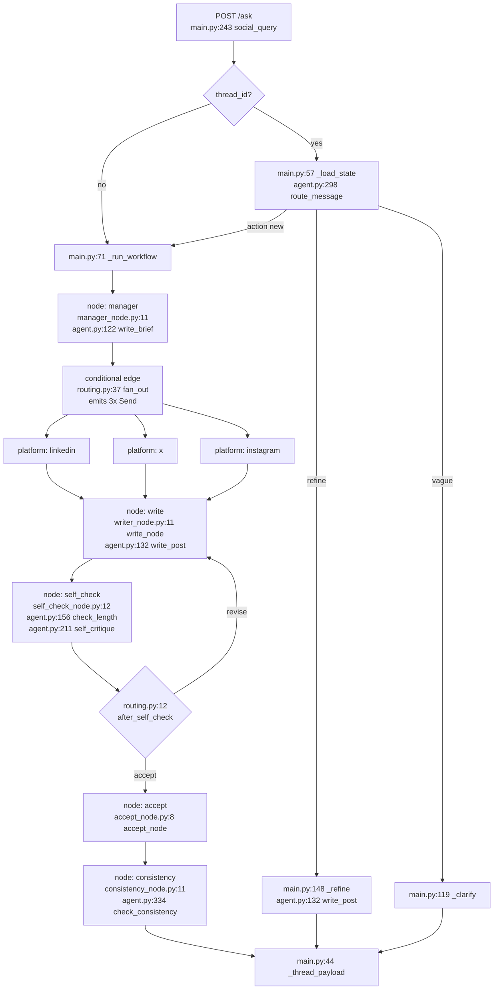

# Code flow — which function runs at each stage

Every path below is `backend/…`. Line numbers are from the current files and will drift a
little as you edit, so treat them as "look near here", not as gospel.

---

## The pipeline at a glance

---

## Stage by stage

### 0. Boot — runs once at import

| What | Function |
|---|---|
| Open SQLite, set WAL / busy_timeout | `configs/database.py:21` `connect()` |
| Create the `checkpoints` + `writes` tables | `src/graphs/graph.py:20` `build_checkpointer()` → `SqliteSaver.setup()` |
| Build the inner per-platform subgraph | `src/graphs/graph.py:27` `build_platform_graph()` |
| Wire and compile the outer graph | `src/graphs/graph.py:53` `build_graph()` |
| Create the `threads` table | `src/store/thread_store.py:15` `ThreadStore.__init__` → `configs/database.py:55` `init_thread_index()` |

Called from `main.py:31-34`.

### 1. Request arrives

| What | Function |
|---|---|
| The endpoint | `main.py:243` `social_query()` |
| Validate the body | `src/models/models.py:8` `SocialInput` (+ its two `field_validator`s) |
| No `thread_id` → new run | `main.py:71` `_run_workflow()` |
| Has `thread_id` → load the checkpoint | `main.py:57` `_load_state()` |

### 2. Brief — the manager

| What | Function |
|---|---|
| The graph node | `src/node/manager_node.py:11` `manager_node()` |
| The agent | `src/agent.py:122` `write_brief()` |
| The LLM call | `src/agent.py:35` `ask()` |
| Build the message list, prepend `SHARED_PREFIX` | `src/agent.py:28` `_messages()` |
| Pick the model | `configs/llms.py:277` `model_for()` |
| Record the step for the UI | `src/utils/trace.py:17` `event()` |

Node name in the graph: **`manager`** (`graph.py:57`).

### 3. Fan-out — three platforms in parallel

| What | Function |
|---|---|
| The conditional edge | `src/routes/routing.py:37` `fan_out()` |
| Where the platform list comes from | `src/agent.py:94` `RULES` |
| The per-branch state schema | `src/schemas/state.py:29` `PlatformState` |

`fan_out` returns one `Send("platform", {...})` per platform, so LangGraph runs all three
branches in the same superstep. This is what produces the three `platform:<uuid>`
checkpoint namespaces in the database.

### 4. Write

| What | Function |
|---|---|
| The graph node | `src/node/writer_node.py:11` `write_node()` |
| The agent | `src/agent.py:132` `write_post()` |
| Which prompt gets used | `WRITE_TASK` if `state["problem"]` is empty, else `REVISE_TASK` |

Node name: **`write`**. It reads `state["problem"]` to decide whether this is a first draft
or a revision, and emits status `drafted` or `revised`.

### 5. Self-check

| What | Function |
|---|---|
| The graph node | `src/node/self_check_node.py:12` `self_check_node()` |
| Deterministic length gate, runs first and costs nothing | `src/agent.py:156` `check_length()` |
| The LLM critic, only if length passed | `src/agent.py:211` `self_critique()` |
| Is the verdict an approval? | `src/agent.py:179` `_is_ok()` |
| Did the critic echo its checklist instead of reviewing? | `src/agent.py:193` `_is_malformed()` |

Node name: **`self_check`**. Its output is the `problem` string — empty means ship it.

### 6. The self-correction loop

| What | Function |
|---|---|
| The decision | `src/routes/routing.py:12` `after_self_check()` |
| The cap | `src/routes/routing.py:9` `MAX_ATTEMPTS = 3` |

Returns `"revise"` (back to `write`) or `"accept"`. Registered at `graph.py:41`.
This is the edge that produces the 5 / 7 / 9 checkpoint counts per platform namespace.

### 7. Accept

| What | Function |
|---|---|
| The graph node | `src/node/accept_node.py:8` `accept_node()` |
| Merging three branches into one dict | `src/schemas/state.py:9` `merge_drafts()` |
| The subgraph's output schema | `src/schemas/state.py:41` `PlatformOutput` |

Node name: **`accept`**. Status is `accepted`, or `accepted_as_is` when the attempt budget
ran out with a problem still open.

### 8. Consistency — the one cross-platform check

| What | Function |
|---|---|
| The graph node | `src/node/consistency_node.py:11` `consistency_node()` |
| The agent | `src/agent.py:334` `check_consistency()` |
| The structured LLM call | `src/agent.py:62` `ask_structured()` |
| The schema it must return | `src/agent.py:330` `ConsistencyReport` / `:325` `Conflict` |
| Rewriting a contradicting post | `src/agent.py:132` `write_post()` again, with `fix=` |

Node name: **`consistency`**. Runs once, after all three branches join.

### 9. Response and persistence

| What | Function |
|---|---|
| Index the thread for the sidebar | `src/store/thread_store.py:29` `record()` |
| Append the user turn to the transcript | `src/store/thread_store.py:62` `append_messages()` |
| Assemble the JSON the frontend reads | `main.py:44` `_thread_payload()` |

`_thread_payload` is the join point: `brief` / `posts` / `trace` / `events` come from the
**checkpoint**, `messages` comes from the **`threads` table**.

---

## The follow-up path

Everything above is the first request. A second request on the same `thread_id` goes here.

| What | Function |
|---|---|
| Load the saved state from the checkpoint | `main.py:57` `_load_state()` |
| Decide refine vs new source | `src/agent.py:298` `route_message()` |
| The schema that constrains it | `src/agent.py:292` `RefineIntent` |

Three outcomes, decided at `main.py:262-274`:

| Router said | Handler |
|---|---|
| `action == "new"` | `main.py:71` `_run_workflow()` — starts a fresh thread |
| no platforms **or** no instruction | `main.py:119` `_clarify()` — asks instead of guessing |
| otherwise | `main.py:148` `_refine()` |

`_refine` does **not** re-run the graph. It calls `write_post()` once per target, then
`workflow_graph.update_state(config, {...})` to write the result back into the checkpoint —
which is why a refinement survives a reload.

---

## The other endpoints

| Route | Handler | Does the work |
|---|---|---|
| `GET /threads` | `main.py:278` `list_threads()` | `thread_store.py:112` `list_all()` |
| `GET /threads/{id}` | `main.py:284` `get_thread()` | `_load_state()` + `_thread_payload()` |
| `DELETE /threads/{id}` | `main.py:291` `delete_thread()` | `thread_store.py:99` `delete()` **and** `checkpointer.delete_thread()` |
| `GET /platforms` | `main.py:313` `platforms()` | reads `RULES` |
| `GET /health` | `main.py:324` `health()` | reads `db_path()` |

---

## Cross-cutting — used by every stage

**Model selection** — `configs/llms.py`

| What | Function |
|---|---|
| Entry point every agent calls | `:277` `model_for()` |
| Capability beats cost | `:74` `resolve_tier()` + `:30` `PINNED_TASKS` |
| The cost heuristic | `:49` `assess_with_reason()` → `:42` `_mentions()` |
| Build / cache the client | `:239` `get_model()`, `:206` `_build_azure()` |
| Is Ollama running? | `:185` `_ollama_is_up()` |

**Prompt caching**

| What | Function |
|---|---|
| Put the cacheable prefix first | `src/agent.py:28` `_messages()` |
| Only Azure has a prefix cache | `configs/llms.py:176` `supports_prompt_cache()` |
| Log HIT / MISS per call | `configs/llms.py:113` `CacheUsageHandler.on_llm_end()` |
| Read `cached_tokens` off the response | `configs/llms.py:83` `_read_cache_usage()` |

**Trace for the UI panel** — `src/utils/trace.py:17` `event()`, ordered by `:7` `STAGE_ORDER`.
Every node returns `trace_events`, and the reducer is `operator.add`, so they concatenate
across all three parallel branches.

**Logging** — `configs/logger.py` `get_logger()` and `preview()`.

---

## Two files that are not in the flow

Worth knowing before someone asks you in a viva.

`src/utils/write_post.py` — a deprecated shim. Nothing imports it; it delegates to
`src.agent.write_post` and logs a warning if it is ever called.

`src/utils/url_input.py` — `fetch_url()` is not wired into any endpoint. Grep the backend
and there are no callers. It is scaffolding for pasting a URL instead of raw text.

---

## The shortest possible answer

> `main.py` is the API layer, `src/graphs/graph.py` wires the graph, `src/node/*.py` are the
> five nodes, `src/routes/routing.py` holds the two branch decisions, and `src/agent.py` is
> the only file that talks to a model — every LLM call in the app goes through `ask()` or
> `ask_structured()` there.
